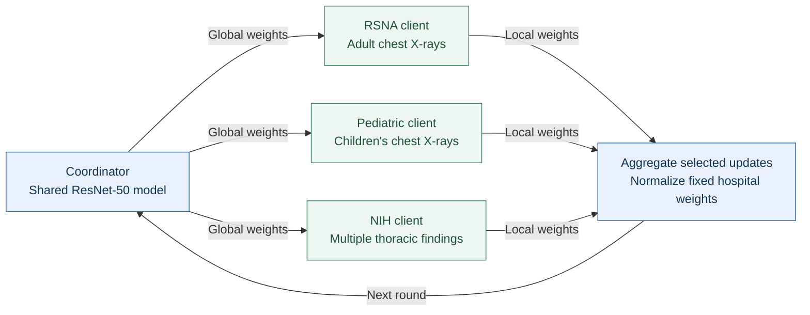

# Federated Learning for Chest X-Ray Classification

A college major project on training a shared pneumonia classifier across separate chest X-ray datasets. Each dataset represents a hospital: training happens locally, and the coordinator combines model weights between rounds.

**Python · PyTorch · ResNet-50 · Federated Averaging · Non-IID data**

[Method](docs/method.md) · [Run guide](docs/running.md) · [Results](docs/results.md)

The study compares local training, standard FedAvg, and fixed weighted aggregation with scheduled hospital participation. Images are classified as **Normal**, **Pneumonia**, or **Other**.

## How it works



The final study uses six communication rounds, three local epochs per round, and fixed aggregation weights of **0.321 for RSNA**, **0.290 for Pediatric**, and **0.389 for NIH**. The participation schedule is deterministic. A separate NIH Q-learning experiment is included in the code; it is not the policy used for the final hospital experiment.

## Results

Test accuracy across the three hospital clients:

| Dataset | Local training | Standard FedAvg | Weighted + scheduled FL |
| :--- | ---: | ---: | ---: |
| RSNA | 81.03% | 79.50% | **84.80%** |
| Pediatric | 81.49% | 79.20% | **87.50%** |
| NIH ChestX-ray14 | 67.29% | **72.80%** | 71.20% |

[Detailed results](docs/results.md).

## Datasets

| Simulated hospital | Source dataset | Images |
| :--- | :--- | ---: |
| Adult | [RSNA Pneumonia Detection](https://www.rsna.org/artificial-intelligence/ai-image-challenge/rsna-pneumonia-detection-challenge-2018) | 26,684 |
| Pediatric | [Kermany chest X-rays](https://data.mendeley.com/datasets/rscbjbr9sj/2) | 5,856 |
| Adult, mixed findings | [NIH ChestX-ray14](https://arxiv.org/abs/1705.02315) | 112,120 |

Images, local manifests, and model checkpoints are kept outside Git. [Dataset setup](docs/datasets.md) covers the expected folders, CSV columns, and label mapping.

## Run the code

Checked with Python 3.12, PyTorch 2.5.1, and torchvision 0.20.1. A GPU is useful for training; the tests use small synthetic inputs on CPU.

```bash
git clone https://github.com/prasadchopade/federated-learning-major-project.git
cd federated-learning-major-project
python -m venv .venv
```

Activate with `.venv\Scripts\Activate.ps1` on PowerShell or `source .venv/bin/activate` on macOS/Linux, then:

```bash
python -m pip install -r requirements.txt
python -m unittest discover -s tests -v
python -m preprocessing.phase5_hospital_training --help
python -m preprocessing.phase5_evaluate_global --help
```

Training requires downloaded data and a starting checkpoint. See the [run guide](docs/running.md) for hospital training, evaluation, and earlier experiments.

## Repository map

| Location | Purpose |
| :--- | :--- |
| [`src/`](src/) | ResNet-50, image loading, local client, and FedAvg server |
| [`preprocessing/`](preprocessing/) | Dataset preparation, baseline experiments, NIH Q-learning, and hospital scripts |
| [`results/`](results/) | Per-hospital classification metrics |
| [`tests/`](tests/) | Checks for data loading, label mapping, model state, and aggregation |
| [`docs/`](docs/) | Method, setup, results, and experiment notes |

[Setup and reproducibility](docs/reproducibility.md).
